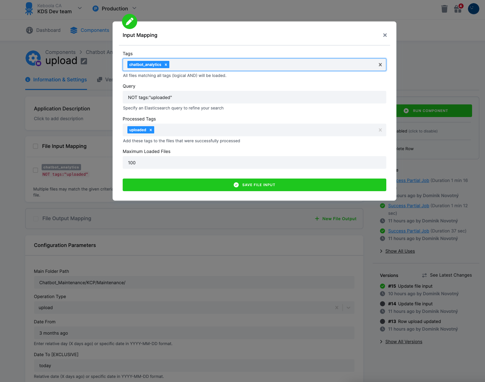

KBC Component
=============

This is a custom component for CSAS that downloads/uploads spreadsheets from/into SharePoint.


**Table of contents:**

[TOC]

Configuration
=============

Accepts following parameters:

- Sharepoint username - example: data_ca@keboolads.onmicrosoft.com
- Sharepoint password
- Authority - example: https://login.microsoftonline.com/{tenant-id}/

- Office 365 Client ID - example: 25d65042-xxxx-xxxx-xxxx-xxxxxxxx
- Office 365 Client Secret
- Microsoft Tenant ID - example: 6f4e5157-xxxx-xxxx-xxxx-xxxxxxxxx
- Hostname - example: keboolads.sharepoint.com
- Url - example: sites/chatbot-files

Row configuration:

- Main Folder Path - example: chatbot/subfolder/Maintenance/
- Operation Type - download/upload
- Date From - Enter relative day (X days ago) or specific date in YYYY-MM-DD format.
- Date To [Exclusive] - Relative date (X days ago) or specific date in YYYY-MM-DD format.
- Folder Suffix - String that will be appended to folder names for both download and upload.


### Component Configuration

**Generic configuration**

```json
{
  "parameters": {
    "o365": {
      "url": "sites/chatbot-files",
      "hostname": "keboolads.sharepoint.com",
      "client_id": "xxx",
      "tenant_id": "6f4e5157-xxxx-xxxx-xxxx-xxxxxxxxx",
      "#client_secret": "xxxx"
    },
    "sharepoint": {
      "username": "data_ca@keboolads.onmicrosoft.com",
      "#password": "xxxxx",
      "authority": "https://login.microsoftonline.com/6f4e5157-xxxx-xxxx-xxxx-xxxxxxx/"
    }
  }
}
```

**Row configuration**

```json
{
  "parameters": {
    "date_to": "today",
    "date_from": "1 day ago",
    "folder_suffix": "_Maintenance",
    "operation_type": "download",
    "main_folder_path": "chatbot/subfolder/Maintenance/"
  }
}
```

**Functionality Notes**

Download previous day data:
```json
{"date_from":"yesterday",
"date_to":"today"}
```
Upload today's data:

```json
{"date_from":"today",
"date_to":"tomorrow"}
```
Download 2023-03-16:

```json
{"date_from":"2023-03-16",
"date_to":"2023-03-17"}
```
Download last month's data:

```json
{"date_from":"1 month ago",
"date_to":"today"}
```

File mapping for upload:



File mapping for download is handled by the component - tags "chatbot_analytics" are added automatically.


Output
======

List of tables, foreign keys, schema.

Development
-----------

If required, change local data folder (the `CUSTOM_FOLDER` placeholder) path to
your custom path in the docker-compose file:

~~~~~~~~~~~~~~~~~~~~~~~~~~~~~~~~~~~~~~~~~~~~~~~~~~~~~~~~~~~~~~~~~~~~~~~~~~~~~~~~
    volumes:
      - ./:/code
      - ./CUSTOM_FOLDER:/data
~~~~~~~~~~~~~~~~~~~~~~~~~~~~~~~~~~~~~~~~~~~~~~~~~~~~~~~~~~~~~~~~~~~~~~~~~~~~~~~~

Clone this repository, init the workspace and run the component with following
command:

~~~~~~~~~~~~~~~~~~~~~~~~~~~~~~~~~~~~~~~~~~~~~~~~~~~~~~~~~~~~~~~~~~~~~~~~~~~~~~~~
git clone repo_path my-new-component
cd my-new-component
docker-compose build
docker-compose run --rm dev
~~~~~~~~~~~~~~~~~~~~~~~~~~~~~~~~~~~~~~~~~~~~~~~~~~~~~~~~~~~~~~~~~~~~~~~~~~~~~~~~

Run the test suite and lint check using this command:

~~~~~~~~~~~~~~~~~~~~~~~~~~~~~~~~~~~~~~~~~~~~~~~~~~~~~~~~~~~~~~~~~~~~~~~~~~~~~~~~
docker-compose run --rm test
~~~~~~~~~~~~~~~~~~~~~~~~~~~~~~~~~~~~~~~~~~~~~~~~~~~~~~~~~~~~~~~~~~~~~~~~~~~~~~~~

Integration
===========

For information about deployment and integration with KBC, please refer to the
[deployment section of developers
documentation](https://developers.keboola.com/extend/component/deployment/)
